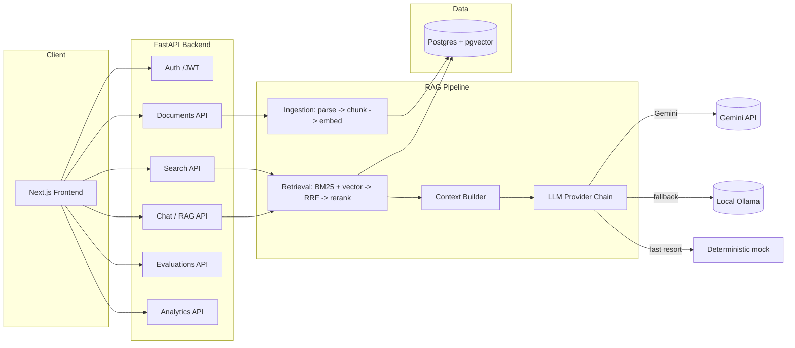

# Enterprise Knowledge Intelligence Platform

An internal knowledge-search and RAG assistant built for a fictional financial
services company, **Acme Financial Services**. Employees upload policies and
procedures; the system indexes them, retrieves the right passages for a
natural-language question using hybrid search, and answers with citations
back to the exact page/section — while enforcing per-document, role-based
access control before anything reaches the language model.

This is a portfolio project built to demonstrate production-oriented AI
engineering: hybrid retrieval, reranking, context engineering, grounded
generation, RBAC-filtered retrieval, an evaluation harness, and observability
— not a "chat with a PDF" demo.

## Problem Statement

Large organizations accumulate policy and procedure documents faster than
employees can find them, and generic search returns keyword matches with no
sense of what's actually relevant, no respect for who's allowed to see what,
and no way to verify an answer against its source. This project builds the
internal tool a mid-size enterprise would actually deploy: search that
understands intent, answers that cite their sources, and access control that
holds even inside an LLM pipeline.

## Features

- **Hybrid retrieval**: BM25 keyword search + dense vector search, fused with
  Reciprocal Rank Fusion, then reranked with a cross-encoder.
- **Three inspectable retrieval modes** (semantic / keyword / hybrid) exposed
  directly in the Search page and the evaluation harness.
- **Context engineering**: dedup, per-document caps, and a hard token budget
  applied before anything is sent to the LLM.
- **Grounded generation with real citations** — `[n]` markers resolve to the
  exact document/page/section/passage, never fabricated.
- **Provider-agnostic LLM layer**: Gemini (free tier) → Ollama (local) →
  deterministic offline fallback, tried in order.
- **Document-level RBAC enforced at the retrieval SQL layer**, not after the
  fact — an unauthorized chunk is never fetched, let alone shown to the LLM.
- **Evaluation harness**: 57 grounded Q&A pairs, Recall@K/Precision@K/MRR,
  groundedness/relevance/citation-correctness, RBAC-violation tests, latency
  and token usage — exported to JSON/CSV and viewable in the Evaluations page.
- **Observability**: every query logged with retrieval scores, rerank scores,
  prompt size, provider, latency, and token counts; visible in Analytics.
- **Source/context inspector** in the Chat UI — see every retrieved chunk,
  its vector/BM25/rerank scores, and which ones actually got cited.

## Architecture



See [docs/ARCHITECTURE.md](docs/ARCHITECTURE.md) for the full system design,
[docs/RAG_PIPELINE.md](docs/RAG_PIPELINE.md) for retrieval/generation
internals, and [docs/EVALUATION.md](docs/EVALUATION.md) for the eval harness.

## Technology Stack

| Layer | Choice | Why |
|---|---|---|
| Frontend | Next.js 14 (App Router), TypeScript, Tailwind CSS | Fast to build a real multi-page enterprise UI |
| Backend | FastAPI, Pydantic v2, SQLAlchemy 2.0 | Typed, async-capable, minimal ceremony |
| Database | PostgreSQL + pgvector | One store for relational + vector data; free, self-hostable |
| Embeddings | `sentence-transformers` (`all-MiniLM-L6-v2`) | Free, local, CPU-friendly, 384-dim |
| Reranker | `cross-encoder/ms-marco-MiniLM-L-6-v2` | Free, local, meaningfully improves top-K precision |
| Keyword search | `rank_bm25` (real BM25, not a substring match) | Explainable, no extra infra |
| LLM | Gemini (free tier) → Ollama → offline mock | No hard dependency on one vendor |
| Auth | Local JWT (dev/Docker) / Supabase Auth (hosted) | Same claim shape either way |
| Deployment | Docker Compose (local), Vercel + Render/Fly/Supabase (hosted) | Free-tier friendly |

## Screenshots

> _Placeholders — populate after running the app locally (see below)._

| Page | Screenshot |
|---|---|
| Dashboard | `docs/screenshots/dashboard.png` |
| Chat + source inspector | `docs/screenshots/chat.png` |
| Search (retrieval scores) | `docs/screenshots/search.png` |
| Evaluations | `docs/screenshots/evaluations.png` |

## Installation & Local Development

### Prerequisites

- Docker + Docker Compose (recommended path), **or** Python 3.12 + Node 20 +
  a local PostgreSQL with the `vector` extension for a non-Docker setup.

### Option A — Docker Compose (recommended)

```bash
cp .env.example .env        # fill in GEMINI_API_KEY if you have one; optional
docker compose up --build
```

This starts Postgres (with pgvector), the backend on `:8000`, and the
frontend on `:3000`. On first backend startup, the schema is created and two
demo users are seeded automatically (see below). Then ingest the sample
corpus:

```bash
docker compose exec backend python scripts/seed_db.py
```

Open http://localhost:3000 and sign in.

### Option B — Run natively

```bash
# Backend
cd backend
python -m venv .venv && .venv/Scripts/activate   # or source .venv/bin/activate on macOS/Linux
pip install -r requirements-dev.txt
cp ../.env.example .env   # point DATABASE_URL at your local Postgres+pgvector
python ../scripts/seed_db.py
uvicorn app.main:app --reload

# Frontend (separate terminal)
cd frontend
npm install
npm run dev
```

### Demo accounts

| Role | Email | Password |
|---|---|---|
| Admin | `admin@acmefs.com` | `AdminPass123!` |
| Employee | `employee@acmefs.com` | `EmployeePass123!` |

The admin account can see three additional Restricted documents (Incident
Response Procedures, Business Continuity Plan, Executive Compensation
Policy) that the employee account cannot — this is the RBAC boundary the
tests and evals exercise.

## Environment Variables

See [.env.example](.env.example) for the full list. The only one you need to
touch for a richer demo is `GEMINI_API_KEY` (free tier at
https://aistudio.google.com/apikey) — without it, the app still works fully,
falling back to a local Ollama model if running, or a deterministic
extractive answerer otherwise.

## Running Evaluations

```bash
python scripts/seed_db.py           # if not already done
python scripts/run_evals.py         # hybrid mode, lexical-heuristic scoring
python scripts/run_evals.py --mode semantic
python scripts/run_evals.py --llm-judge   # use the LLM itself to score groundedness/relevance
```

Results are written to `evals/results/eval_run_<timestamp>.{json,csv}` and
`evals/results/latest.json`, and are viewable in the app's Evaluations page
(admins can also trigger a run from there). See
[docs/EVALUATION.md](docs/EVALUATION.md) for the metric definitions and how
to read the results.

## Deployment

See [docs/DEPLOYMENT.md](docs/DEPLOYMENT.md) for the full guide: Docker
Compose for a self-hosted box, or Vercel (frontend) + Render/Fly.io (backend)
+ Supabase (Postgres+pgvector and Auth) for a free hosted deployment.

## API Architecture

FastAPI app under `backend/app`, routed by domain (`auth`, `documents`,
`search`, `chat`, `evaluations`, `analytics`), each a thin layer over the
`app.rag`, `app.retrieval`, `app.ingestion`, and `app.evaluation` modules —
routes never touch retrieval/LLM internals directly. Full endpoint reference
via the auto-generated OpenAPI docs at `/docs` once the backend is running.

## Database Architecture

Seven tables in Postgres: `users`, `documents`, `chunks` (with a pgvector
`embedding` column and an `ivfflat` cosine index), `conversations`,
`messages`, `query_logs`, and `eval_runs`. See
[docs/ARCHITECTURE.md](docs/ARCHITECTURE.md#database-schema) for the full
schema and an ER diagram.

## RAG Architecture

Query → keyword retrieval (BM25) + vector retrieval (pgvector), both already
RBAC-filtered → Reciprocal Rank Fusion → cross-encoder rerank → context
builder (dedup, token budget, per-doc cap) → LLM (citation-forcing prompt) →
citation extraction resolved strictly against the context actually sent.
Full detail in [docs/RAG_PIPELINE.md](docs/RAG_PIPELINE.md).

## Evaluation Results

Run `python scripts/run_evals.py` and see `evals/results/latest.json`, or
open the Evaluations page in the app. Numbers are **not** included here
statically — they depend on which LLM provider is configured, and printing
made-up numbers in a README that a reviewer can immediately reproduce (or
fail to reproduce) would undermine the point of having a real eval harness.
Run it and see the truth.

## Limitations

- **No Docker/pgvector in this build environment**: this project was built
  in a Windows sandbox without Docker available, so the full Postgres+pgvector
  integration path (DB-backed tests, `seed_db.py`, the live API) is written
  and correct but was verified via GitHub Actions' `pgvector/pgvector`
  service container and manual review, not executed end-to-end on this
  machine. All DB-independent logic (chunking, parsing, embeddings, reranker,
  RRF fusion, context builder, citations, mock LLM, evaluation metrics — 60
  tests) was run for real, including with real embedding/reranker model
  downloads. See `PLAN.md` for details.
- BM25 is recomputed per query over the RBAC-filtered candidate set rather
  than maintained as a persistent index — fine at this corpus's scale (~25
  documents), not how you'd do it at real enterprise scale (see
  `docs/RAG_PIPELINE.md`).
- The lexical-overlap groundedness/relevance heuristics are a deliberately
  cheap, dependency-free default; `--llm-judge` swaps in real LLM-based
  scoring when a real provider is configured.
- No re-ranking of documents by recency/authority — relevance is purely
  semantic + lexical.
- Frontend auth is a minimal local JWT implementation for demo purposes; the
  hosted deployment path uses Supabase Auth instead (same claim shape).
- Known npm advisory in `next@14.2.x` (Image Optimization API AVIF RCE,
  GHSA-2xp9-vwfh-vxw4) — this app never uses `next/image`, so the vulnerable
  code path is not reachable; noted here rather than forcing an unrelated
  major-version migration.

## Future Improvements

- Streaming responses (SSE) in the Chat UI.
- Persistent BM25/OpenSearch index instead of per-query rebuild.
- Multi-turn conversational retrieval (query rewriting using chat history).
- Document versioning and re-ingestion diffing.
- Per-department retrieval weighting / personalization.
- Async ingestion queue for large document batches.

## Project Structure

```
frontend/       Next.js app (App Router)
backend/        FastAPI app, ingestion/retrieval/RAG/eval modules, pytest suite
sample_data/    ~25 synthetic Acme Financial Services documents (pdf/docx/txt/md)
evals/          qa_dataset.json (57 Q&A pairs) + results/
scripts/        seed_db.py, run_evals.py, sample-data generation helper
docs/           ARCHITECTURE, RAG_PIPELINE, EVALUATION, DEPLOYMENT, RESUME
docker/         (docker-compose.yml lives at repo root)
.github/        CI workflow
```

## License

MIT — see [LICENSE](LICENSE).
