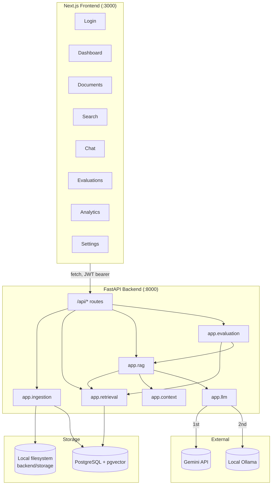
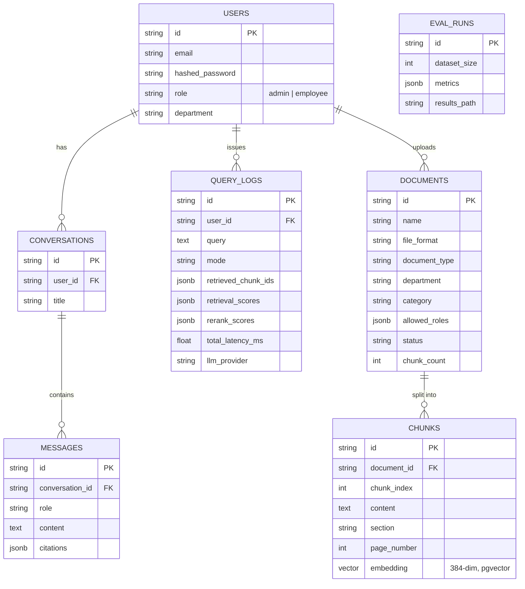
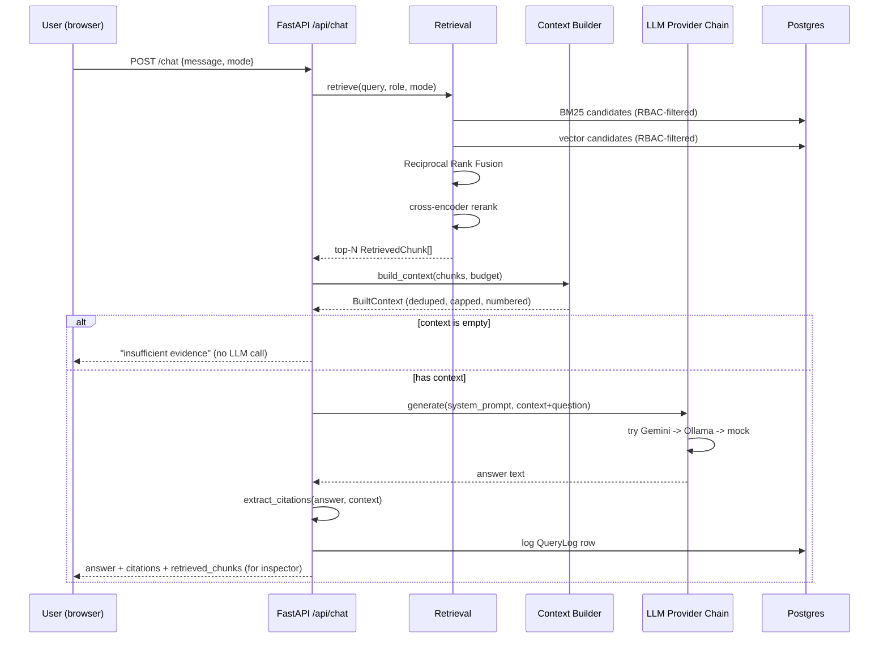

# Architecture

## System Overview



## Backend Module Layout

```
backend/app/
├── main.py                 FastAPI app, router wiring, lifespan (DB init + seed)
├── config.py                Settings (env-driven, single source of truth)
├── core/
│   ├── security.py          JWT issuance/verification, password hashing
│   └── rbac.py               role_can_access() — the one RBAC predicate
├── db/
│   ├── models.py             SQLAlchemy ORM models
│   ├── session.py            engine/session factory
│   └── bootstrap.py          init_db(), seed_users() — idempotent setup
├── ingestion/
│   ├── parsers.py            pdf/docx/txt/md -> ParsedBlock[]
│   ├── chunking.py           heading/paragraph-aware chunker
│   └── pipeline.py           parse -> chunk -> embed -> store
├── retrieval/
│   ├── embeddings.py         sentence-transformers wrapper (singleton)
│   ├── reranker.py            cross-encoder wrapper (singleton)
│   ├── vector_search.py       pgvector query, RBAC-filtered
│   ├── keyword_search.py      BM25 over RBAC-filtered candidate set
│   ├── fusion.py               Reciprocal Rank Fusion
│   └── pipeline.py             orchestrates the above into 3 retrieval modes
├── context/
│   └── builder.py              dedup, token budget, per-doc cap, citation numbering
├── llm/
│   ├── base.py                  LLMProvider ABC, LLMResult, LLMProviderError
│   ├── gemini_provider.py       Gemini REST API (httpx, no SDK)
│   ├── ollama_provider.py       Local Ollama REST API
│   ├── mock_provider.py         Deterministic extractive fallback (tests/CI)
│   └── factory.py                Fallback chain walker
├── rag/
│   ├── pipeline.py               retrieval -> context -> generation orchestration
│   └── citations.py              resolves [n] markers to real source chunks
├── evaluation/
│   ├── metrics.py                 pure retrieval/generation metric functions
│   ├── llm_judge.py                optional LLM-as-judge scoring
│   └── runner.py                    replays evals/qa_dataset.json end to end
├── schemas/                        Pydantic request/response models
└── api/routes/                     auth, documents, search, chat, evaluations, analytics
```

## Database Schema



`allowed_roles` is `JSONB` specifically so RBAC filtering can use Postgres's
`@>` containment operator directly in the retrieval `WHERE` clause (see
`app/retrieval/vector_search.py` and `keyword_search.py`) rather than
filtering rows in Python after they've already been fetched.

## Request Flow: Chat / RAG Query



## Authentication

Local/Docker dev uses a self-contained JWT flow (`app/core/security.py`):
`POST /auth/login` verifies a bcrypt-hashed password and issues a JWT with
`{sub, role, email}` claims; every other route decodes that JWT via the
`get_current_user` dependency. The hosted deployment swaps this for Supabase
Auth, which issues JWTs verified against Supabase's JWKS — the claim shape
is compatible by design, so nothing downstream of `get_current_user` changes
(see `docs/DEPLOYMENT.md`).

## RBAC Enforcement Point

The critical design decision: RBAC is enforced as a `WHERE` predicate inside
`vector_search()` and `keyword_search()`, not as a filter applied to results
afterward. An employee-role query for content only an admin-only document
contains never causes that document's chunks to be fetched from Postgres,
let alone reach the context builder or the LLM. `backend/tests/test_rbac.py`
proves this directly, and `evals/qa_dataset.json` includes three
`rbac_negative` questions that assert the same thing end-to-end through the
full RAG pipeline.
